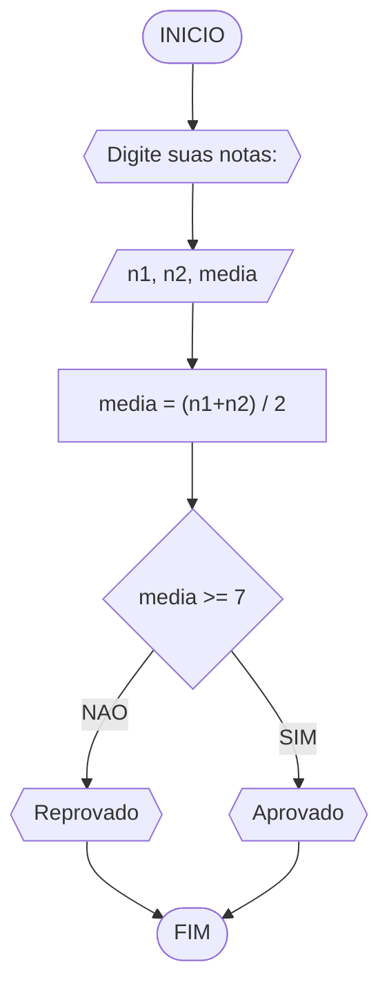
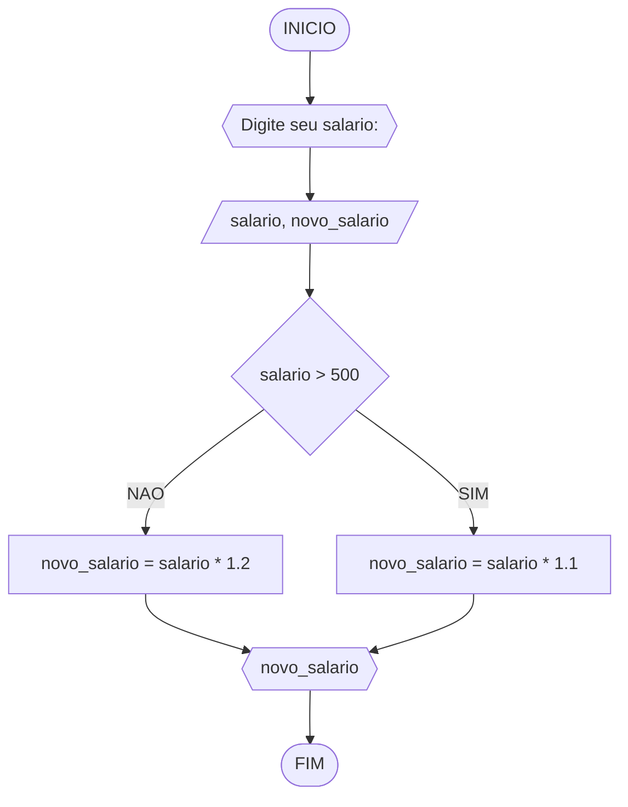
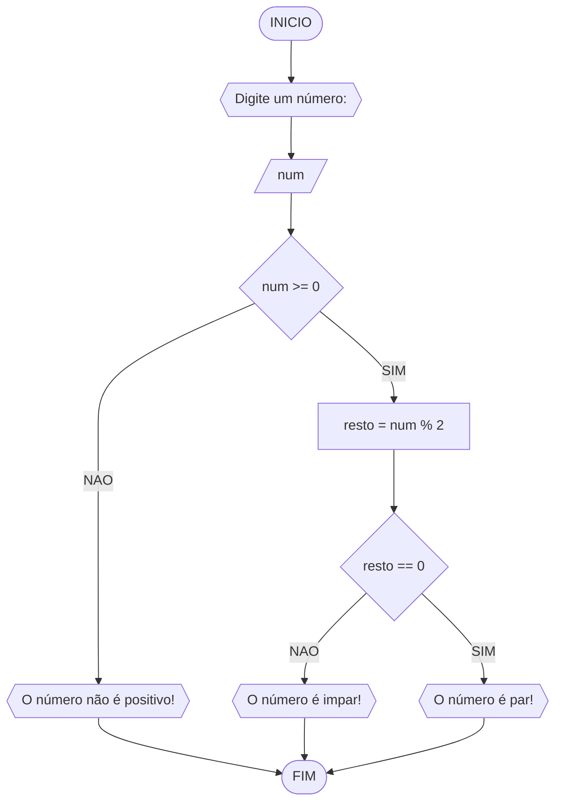

# UNIFOR
**Nome**: Alisson Frota Teixeira <br>
**Disciplina**: Raciocínio Lógico Algorítimico

## Lista de exercícios 01
### Exercício 1
Represente, em fluxograma e pseudocódigo, um algoritmo para calcular a média aritmética entre duas notas de um aluno e mostrar sua situação, que pode ser aprovado ou reprovado

#### Fluxograma


#### Pseudocódigo
```
ALGORITIMO media_notas
DECLARE n1, n2, media: FLOAT
ESCREVA "Digite suas notas: "
INICIO
LEIA n1, n2
media <- (n1 + n2) / 2
SE media >= 7 ENTAO
	ESCREVA "Aprovado"
SENAO
	ESCREVA "Reprovado"
FIM_SE
FIM
```

#### Teste
| n1 | n2 | media | media>=7 | saída
| -- | -- | -- | -- | -- |
| 10 | 10 | 10 | True | Aprovado
| 7 | 7 | 7 | True | Aprovado
| 6.5 | 7.4 | 6.9 | False | Reprovado

### Exercício 2
Represente, em fluxograma e pseudocódigo, um algoritmo para calcular o novo salário de um
funcionário. Sabe-se que os funcionários que recebem atualmente salário de até R$ 500 terão
aumento de 20%; os demais terão aumento de 10%.

#### Fluxograma


#### Pseudocódigo
```
ALGORITIMO novo_salario
DECLARE salario, novo_salario: FLOAT
ESCREVA "Digite seu salario: "
INICIO
LEIA salario
SE salario > 500 ENTAO
	novo_salario <- salario * 1.1
SENAO
	novo_salario <- salario * 1.2
FIM_SE
ESCREVA novo_salario
FIM
```

#### Teste
| salario | salario > 500 | novo_salario |
| -- | -- | -- |
| 300 | False | 330 |
| 500 | False | 550 |
| 501 | True | 601.2 |
### Exercício 3
Represente, em fluxograma e pseudocódigo, um algoritimo para determinar se um número inteiro e positivo é par ou impar.

#### Fluxograma


#### Pseudocódigo
```
ALGORITMO verifica_par_impar
DECLARE num, resto: int
INICIO
ESCREVA "Digite um número: "
LEIA num
SE num >= 0 ENTAO
	resto <- num % 2
	SE resto == 0 ENTAO
		ESCREVA "O número é par!"
	SENAO
		ESCREVA "O número é impar!"
	FIM_SE
SENAO
	ESCREVA "O número não é positivo!"
FIM_SE
FIM
```

#### Teste
| num | num >= 0 | resto | resto == 0 | saída |
| -- | -- | -- | -- | -- |
| -1 | False |  |  | "O número deve ser positivo" 
| 0 | True | 0 | True | "O número é par !" 
| 10 | True | 0 | True | "O número é par!" 
| 11 | True | 1 | False | "O número e impar" 


