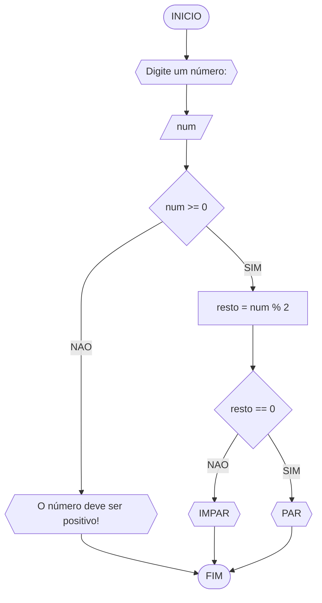

# UNIFOR
**Nome**: Alisson Frota Teixeira <br>
**Disciplina**: Raciocínio Lógico Algorítimico

## Lista de exercícios 01

### Exercício 3
Represente, em fluxograma e pseudocódigo, um algoritimo para determinar se um número inteiro e positivo é par ou impar

#### Fluxograma


#### Pseudocódigo
```
ALGORITMO verifica_par_impar
DECLARE num, resto: int
INICIO
ESCREVA "Digite um número: "
LEIA num
SE num >= 0 ENTAO
	resto <- num % 2
	SE resto == 0 ENTAO
		ESCREVA "PAR"
	SENAO
		ESCREVA "IMPAR"
	FIM_SE
SENAO
	ESCREVA "Esse número não e positivo"
FIM_SE
FIM
```

#### Teste
| num | num >= 0 | resto | resto == 0 | saída |
| -- | -- | -- | -- | -- |
| -1 | False |  |  | "O número deve ser positivo" | 0 | True | 0 | True | "O número é par !" | 10 | True | 0 | True | "O número é par!" | 11 | True | 1 | False | "O número e impar" 


