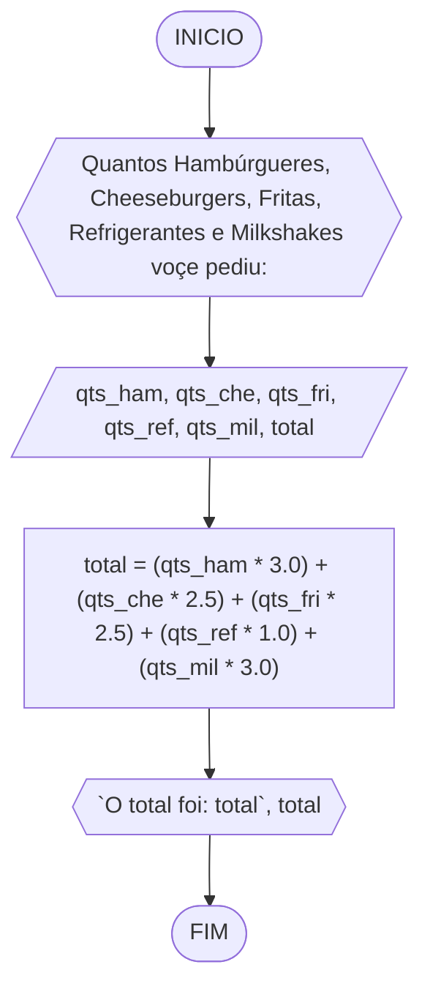
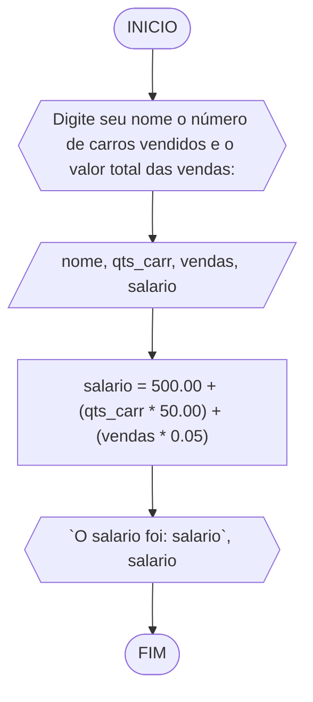
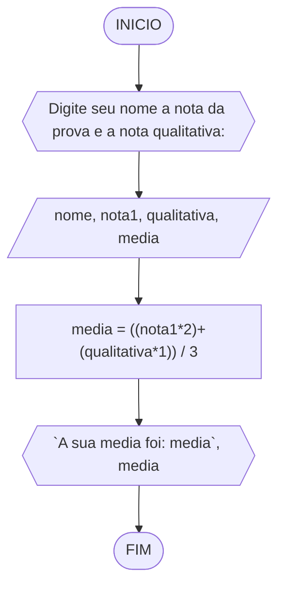

# UNIFOR
**Nome**: Alisson Frota Teixeira <br>
**Disciplina**: Raciocínio lógico algorítmico

## Lista de exercícios 02

### Exercício 1
Calcule a média de quatro números inteiros dados.

#### Fluxograma


#### Pseudocódigo
```
ALGORITMO media_entre_4
DECLARE n1, n2, n3, n4: int, media: float
INICIO
ESCREVA "Digite quatro números inteiros: "
LEIA n1, n2, n3, n4
media <- (n1, n2, n3, n4) / 4
ESCREVA "A media dos quatro números é: media", media
FIM
```

#### Teste
| n1 | n2 | n3 | n4 | media | saída |
| -- | -- | -- | -- | -- | -- |
| 5 | 7 | 1 | 9 | 5.5 | A media dos quatro números é: 5.5 | | 
| 18 | 25 | 69 | 48 | 40.0 | A media dos quatro números é: 40.0| |
| 1 | 1 | 1 | 1 | 1.0 | A media dos quatro números é: 1.0 || 

### Exercício 2
Leia uma temperatura dada na escala Celsius (C) e imprima o equivalente em Fahrenheit (F). (Fórmula de conversão: F = (9/5) * C + 32)

#### Fluxograma


#### Pseudocódigo
```
ALGORITMO celsius_para_fahrenheit
DECLARE c, f: float
INICIO
ESCREVA "Digite a temperatura em ºC: "
LEIA c
f <- (9/5) * C + 32
ESCREVA "A temperatura em fahrenheit é: f", f
FIM
```

#### Teste
| c | f | saída |
| -- | -- | -- | 
| 10.0 | 50.0 | A temperatura em fahrenheit é: 50.0 |
| 0.0 | 32.0 | A temperatura em fahrenheit é: 32.0 |
| 25.5 | 77.9 | A temperatura em fahrenheit é: 77.9 |

### Exercício 3
Leia uma quantidade de chuva dada em polegadas e imprima o equivalente em milímetros (25,4 mm = 1 polegada).

#### Fluxograma


#### Pseudocódigo
```
ALGORITMO polegadas_para_mm
DECLARE polegadas, mm: float
INICIO
ESCREVA "Digite a quantidade de chuva em polegadas: "
LEIA polegadas
mm <- polegadas * 25.4
ESCREVA "A quantidade de chuva em mm é: mm", mm
FIM
```

#### Teste
| polegadas | mm | saída |
| -- | -- | -- | 
| 10.0 | 254.0 | A quantidade de chuva em mm é: 254.0 |
| 0.2 | 5.08 | A quantidade de chuva em mm é: 5.08 |
| 25.5 | 647.7 | A quantidade de chuva em mm é: 647.7 |

### Exercício 4
O custo ao consumidor de um carro novo é a soma do custo de fábrica com a porcentagem do distribuidor e dos impostos, ambos aplicados ao custo de fábrica. Supondo que a porcentagem do distribuidor seja de 12% e a dos impostos de 45%, prepare um algoritmo para ler o custo de fábrica do carro e imprimir o custo ao consumidor.

#### Fluxograma


#### Pseudocódigo
```
ALGORITMO preco_fabrica_para_preco_consumidor
DECLARE preco_fabrica, preco_consumidor: float
INICIO
ESCREVA "Digite o preço de fabrica do carro: "
LEIA preco_fabrica
preco_consumidor <- (preco_fabrica * 1.12) + (preco_fabrica * 0.45)
ESCREVA "O preço do carro para o consumidor é: preco_consumidor", preco_consumidor
FIM
```

#### Teste
| preco_fabrica | preco_consumidor | saída |
| -- | -- | -- | 
| 1500.0 | 2355.0 | O preço do carro para o consumidor é: 2355.0|
| 300.0 | 471.0 | O preço do carro para o consumidor é: 471.0|
| 353.32 | 554.746 | O preço do carro para o consumidor é: 554.746 |

### Exercício 5
Calcule o quadrado de um número.

#### Fluxograma


#### Pseudocódigo
```
ALGORITMO calc_quadrado_numero
DECLARE n, n_pow: float
INICIO
ESCREVA "Digite um número: "
LEIA n
n_pow <- n**2
ESCREVA "O seu número ao quadrado é: n_pow", n_pow
FIM
```

#### Teste
| n | n_pow | saída |
| -- | -- | -- | 
| 5.0 | 25.0 | O seu número ao quadrado é: 25.0|
| 1.0 | 1.0 | O seu número ao quadrado é: 1.0|
| 2.3 | 5.29 | O seu número ao quadrado é: 5.29 |

### Exercício 6
O cardápio de uma lanchonete é dado abaixo. Prepare um algoritmo que leia a quantidade de cada item que você consumiu e calcule a conta final. <br>
a) Hambúrguer................ R$ 3,00 <br>
b) Cheeseburger.............. R$ 2,50 <br>
c) Fritas.................... R$ 2,50 <br>
d) Refrigerante ............. R$ 1,00 <br>
e) Milkshake................. R$ 3,00

#### Fluxograma


#### Pseudocódigo
```
ALGORITMO total_conta
DECLARE qts_ham, qts_che, qts_fri, qts_ref, qts_mil: int, total: float
INICIO
ESCREVA "Quantos Hambúrgueres, Cheeseburgers, Fritas, Refrigerantes e Milkshakes voçe pediu: "
LEIA qts_ham, qts_che, qts_fri, qts_ref, qts_mil
total <- (qts_ham * 3.0) + (qts_che * 2.5) + (qts_fri * 2.5) + (qts_ref * 1.0) + (qts_mil * 3.0)
ESCREVA "O total foi: total", total
FIM
```

#### Teste
| qts_ham | qts_che | qts_fri | qts_ref | qts_mil | total | saída |
| -- | -- | -- | -- | -- | -- | -- |
| 1 | 0 | 1 | 2 | 0 |7.5 | O total foi: 7.5
| 0 | 3 | 4 | 0 | 2 |23.5 | O total foi: 23.5 |
| 0 | 0 | 0 | 0 | 0 | 0 | O total foi: 0.0  

### Exercício 7
Uma companhia de carros paga a seus empregados um salário de R$ 500,00 por mês mais uma comissão de R$ 50,00 para cada carro vendido e mais 5% do valor da venda. Elabore um algoritmo para calcular e imprimir o salário do vendedor num dado mês recebendo como dados de entrada o nome do vendedor, o número de carros vendidos e o valor total das vendas.

#### Fluxograma


#### Pseudocódigo
```
ALGORITMO salario_funcionario
DECLARE nome: string, qts_carr: int, vendas, salario: float
INICIO
ESCREVA "Digite seu nome o número de carros vendidos e o valor total das vendas: "
LEIA nome, qts_carr, vendasa
salario <- 500.00 + (qts_carr * 50.00) + (vendas * 0.05)
ESCREVA "O salario foi: salario", salario
FIM
```

#### Teste
| nome | qts_carr | vendas | salario | saída |
| -- | -- | -- | -- | -- |
| Alisson | 3 | 60000.00 | 3650.00 | O salario foi: 3650.00 |
| Pedro | 0 | 0 | 500.00 |O salario foi: 500.00 |
| Enzo | 11 | 2000000.00 | 101050.00 | O salario foi: 101050.00|

### Exercício 8
Calcule a média de um aluno na disciplina de RLA. Para isso solicite o nome do aluno, a nota da prova e a nota qualitativa. Sabe-se que a nota da prova tem peso 2 e a nota qualitativa peso 1. Mostre a média como resultado.

#### Fluxograma


#### Pseudocódigo
```
ALGORITMO media_rla
DECLARE nome: string, nota1, qualitativa, media: float
INICIO
ESCREVA "Digite seu nome a nota da prova e a nota qualitativa: "
LEIA nome, nota1, qualitativa
media <- ((nota1*2) + (qualitativa*1)) /3
ESCREVA "A sua media foi: media", media
FIM
```

#### Teste
| nome | nota1 | qualitativa | media | saída |
| -- | -- | -- | -- | -- |
| Alisson | 9.0 | 5.0 | 7.6 | A sua media foi: 7.6 |
| Pedro | 10.0 | 10.0 | 10.0 |A sua media foi: 10.0 |
| Enzo | 3.5 | 7.8 | 4.9 | A sua media foi: 4.9|

### Exercício 9
Suponha que você deseja preencher a seguinte ficha de inscrição de um estudante: nome, matrícula, curso, idade, e-mail. Imprima os dados do usuário como uma ficha preenchida.

#### Fluxograma


#### Pseudocódigo
```
ALGORITMO ficha_de_inscricao
DECLARE nome, matricula, curso, mail: string, idade: int
INICIO
ESCREVA "Digite seu nome, matrícula, curso, idade e e-mail: "
LEIA nome, matricula, curso, mail, idade
ESCREVA "FICHA DE INSCRIÇÃO"
ESCREVA "Nome: nome", nome
ESCREVA "Matrícula: matricula", matricula
ESCREVA "Curso: curso", curso
ESCREVA "idade: idade", idade
ESCREVA "e-mail: mail", mail
FIM
```

#### Teste
| nome | matricula | curso | mail | idade | saída |
| -- | -- | -- | -- | -- | -- |
| Pedro | 2418631 | Eng. Computação | pedro@edu.unifor.br | 18 | FICHA DE INSCRIÇÃO <br> Nome: Pedro <br> Matrícula: 2418631 <br> Curso: Eng. Computação <br> Idade: 18 <br> e-mail: pedro@edu.unifor.br  |

### Exercício 10
Calcule e mostre a área e o perímetro de um círculo. Sabe-se que a área = Ⲡ * raio2 e o perímetro = 2 * Ⲡ * raio.

#### Fluxograma


#### Pseudocódigo
```
ALGORITMO area_e_perimetro
DECLARE raio, area, perimetro: float
INICIO
ESCREVA "Digite o raio do círculo: "
LEIA raio
perimetro <- 2*3.14*raio
area = 3.14*(raio**2)
ESCREVA "Área = area", area
ESCREVA "Perimetro = perimetro", perimetro
FIM
```

#### Teste
| raio | area | perimetro | saída | 
| -- | -- | -- | -- | 
| 5.0 | 78.5 |31.4 | Área = 78.5 <br> Perimetro = 31.4   | 
| 0.0 | 0.0 | 0.0 | Área = 0.0 <br> Perimetro = 0.0
| 1.0 | 3.14 | 6.28 | Área = 3.14 <br> Perimetro = 6.28

### Exercício 11
Faça um programa que receba um número positivo e maior que zero, calcule e mostre: a) o número digitado ao quadrado; <br>b) o número digitado ao cubo;<br> c) a raiz quadrada do número digitado;<br> d) a raiz cúbica do número digitado.
#### Fluxograma


#### Pseudocódigo
```
ALGORITMO operacao_num
DECLARE num, num_pow2, num_pow3, num_sqrt, num_s3: float
INICIO
ESCREVA "Digite um número: "
LEIA num
SE num > 0 ENTAO
	num_pow2 <- num**2
	num_pow3 <- num**3
	num_sqrt <- num**(1/2)
	num_s3 <- num**(1/3)
	ESCREVA "O número elevado ao quadrado é: num_pow2", num_pow2
	ESCREVA "O número elevado ao cubo é: num_pow3", num_pow3
	ESCREVA "A raiz quadrada do número é: num_sqrt", num_sqrt
	ESCREVA "A raiz cubica do número é: num_s3", num_s3
SENAO
	ESCREVA "O número digitado não e maior que zero"
FIM_SE
FIM
```

#### Teste
| num | num > 0 | num_pow2 |num_pow3 | num_sqrt | num_s3 | saída |
| -- | -- | -- | -- | -- | -- | -- |
| 5.0 | True | 25.0 |125.0 | 2.2   | 1.7 | O número elevado ao quadrado é: 25.0 <br> O número elevado ao cubo é: 125.0 <br> A raiz quadrada do número é: 2.2 <br> A raiz cubica do número é: 1.7
| -3.0 | False | | |  | | O número digitado não e maior que zero

### Exercício 12
Faça um algoritmo que lê três números inteiros e mostra-os em ordem crescente.
#### Fluxograma


#### Pseudocódigo
```
ALGORITMO ordem_crescente
DECLARE n1, n2, n3: int
INICIO
ESCREVA "Digite tres números: "
LEIA n1, n2, n3
SE n1 <= n2 and n1 <= n3 ENTAO
	SE n2 <= n3 ENTAO
		ESCREVA n1, n2, n3
	SENAO
		ESCREVA n1, n3, n2
	FIM_SE
SENAO
	SE n2 <= n1 and n2 <= n3 ENTAO
		SE n1 <= n3 ENTAO
			ESCREVA n2, n1, n3
		SENAO
			ESCREVA n1, n3, n1
		FIM_SE
FIM_SE
	SENAO
		SE n1 <= n2 ENTAO
			ESCREVA n3, n1, n2
		SENAO
			ESCREVA n3, n2, n1
		FIM_SE
FIM_SE
FIM
```

#### Teste
| n1 | n2 | n3 | saída | 
| -- | -- | -- | -- |
| 3 | 10 |5 | 3 / 5 / 10   |
| 9 | 5 | 9 | 5 / 9 / 9 | 
| 15 | 11 | 10 | 10 / 11 / 15 | 


