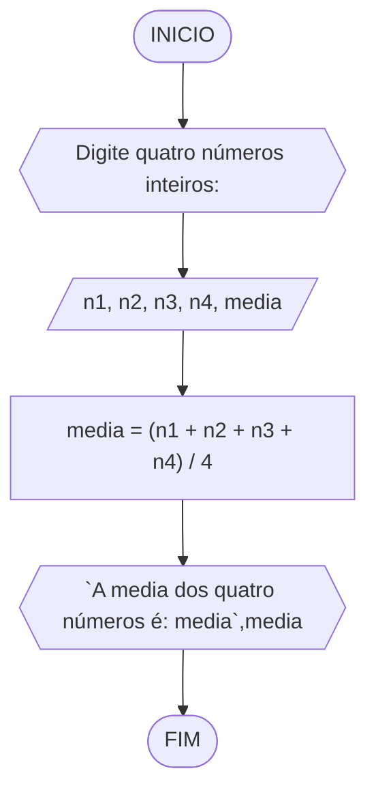

# UNIFOR
**Nome**: Alisson Frota Teixeira <br>
**Disciplina**: Raciocínio lógico algorítmico

## Lista de exercícios 02

### Exercício 1
Calcule a média de quatro números inteiros dados.

#### Fluxograma


#### Pseudocódigo
```
ALGORITMO media_entre_4
DECLARE n1, n2, n3, n4: int, media: float
INICIO
ESCREVA "Digite quatro números inteiros: "
LEIA n1, n2, n3, n4
media <- (n1, n2, n3, n4) / 4
ESCREVA "A media dos quatro números é: media", media
FIM
```

#### Teste
| n1 | n2 | n3 | n4 | media | saída |
| -- | -- | -- | -- | -- | -- |
| 5 | 7 | 1 | 9 | 5.5 | A media dos quatro números é: 5.5 | | 
| 18 | 25 | 69 | 48 | 40.0 | A media dos quatro números é: 40.0| |
| 1 | 1 | 1 | 1 | 1.0 | A media dos quatro números é: 1.0 || 

### Exercício 2
Leia uma temperatura dada na escala Celsius (C) e imprima o equivalente em Fahrenheit (F). (Fórmula de conversão: F = (9/5) * C + 32)

#### Fluxograma


#### Pseudocódigo
```
ALGORITMO celsius_para_fahrenheit
DECLARE c, f: float
INICIO
ESCREVA "Digite a temperatura em ºC: "
LEIA c
f <- (9/5) * C + 32
ESCREVA "A temperatura em fahrenheit é: f", f
FIM
```

#### Teste
| c | f | saída |
| -- | -- | -- | 
| 10.0 | 50.0 | A temperatura em fahrenheit é: 50.0 |
| 0.0 | 32.0 | A temperatura em fahrenheit é: 32.0 |
| 25.5 | 77.9 | A temperatura em fahrenheit é: 77.9 |

