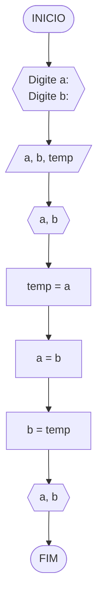
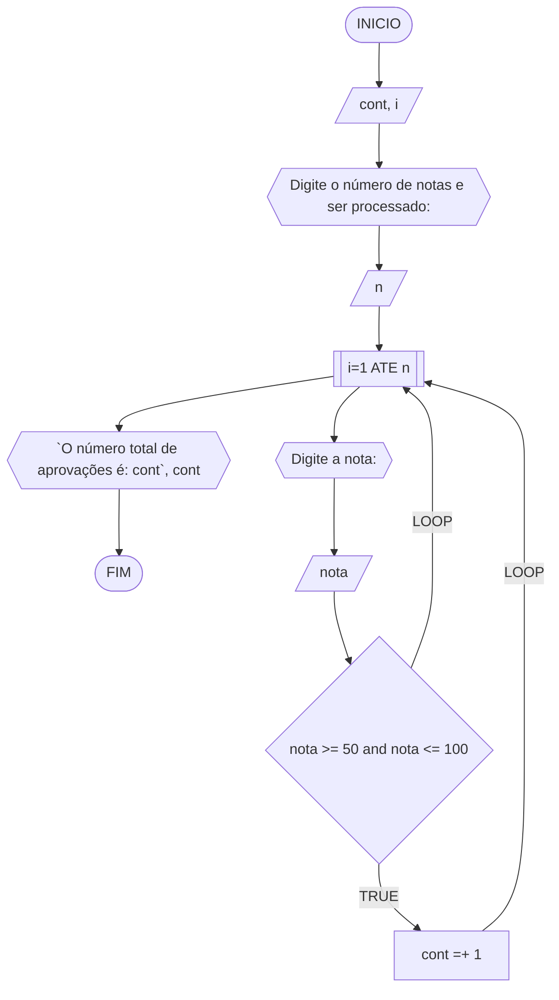
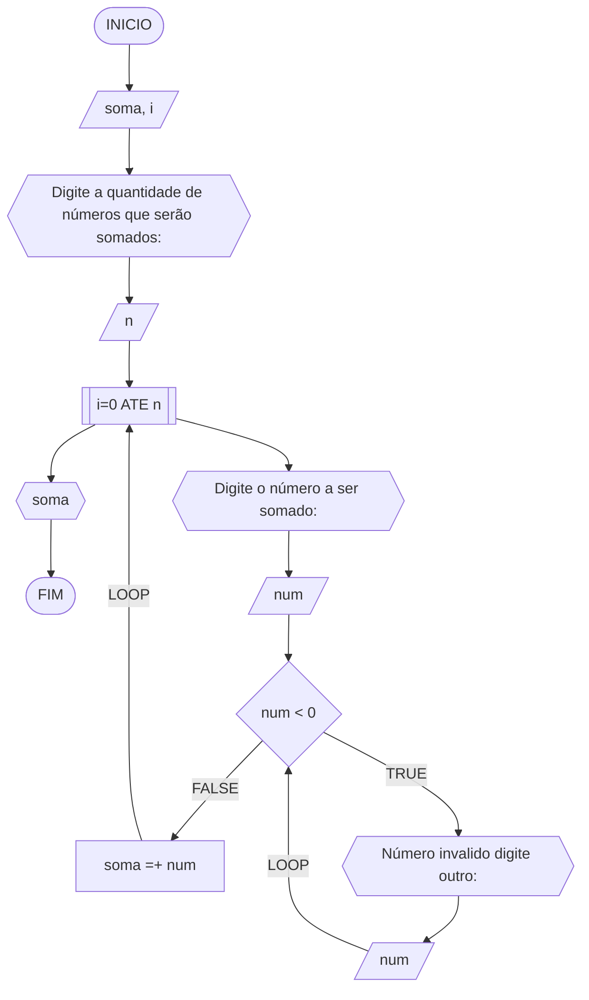
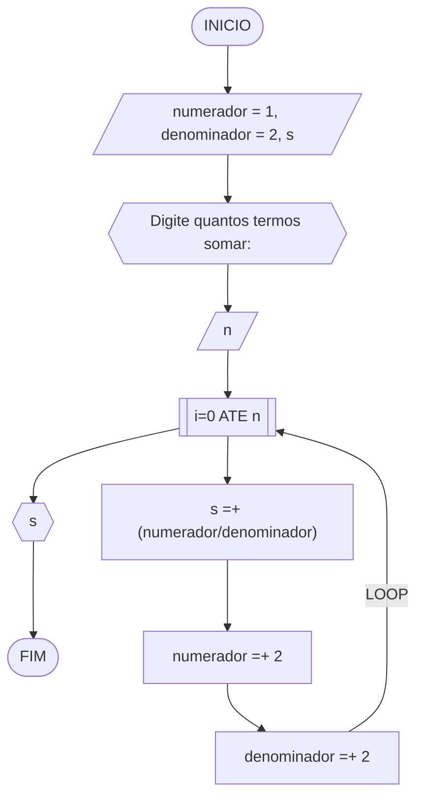
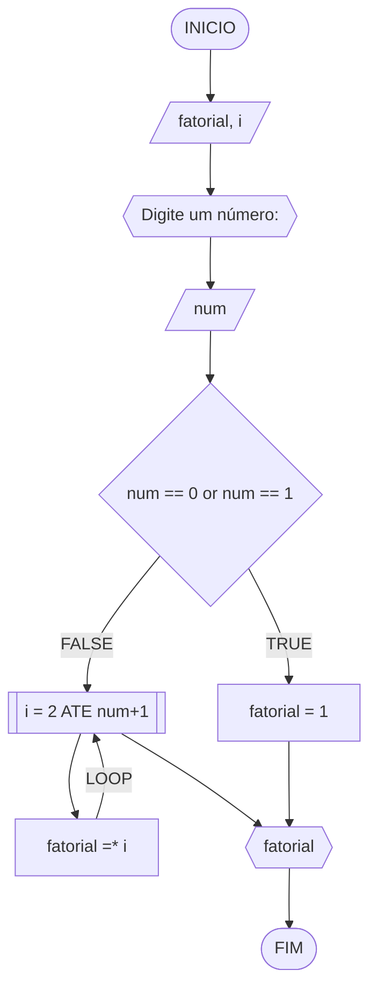
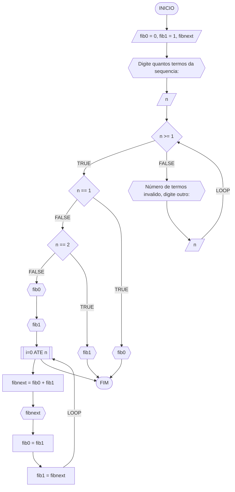

**Curso:** Eng. Computação <br>
**Disciplina:** Raciocínio lógico algorítmico <br>
**Código/Turma:** T998-08 <br>
**Professor:** Ricardo Carubbi <br>
**Data:** 21/03/2024 <br>
**Aluno(a):** Alisson Frota Teixeira <br>
**Matrícula:** 2410301 <br>

**1a chamada (Sim/Não):** Sim <br>
**2a chamada (Sim/Não):** Não

# Avaliação Diagnóstica 1

## Normas e exigências

Avaliação diagnóstica (**AD**) consiste em exercícios ou projetos desenvolvidos em grupo ao longo da disciplina. <br>
A primeira avaliação diagnóstica (**AD1**) será composta por exercícios e equivale a 30% da nota da primeira avaliação (**AV1**).

Segue abaixo a expressão para o cálculo da **AV1**, sendo sendo **AF1** equivale a primeira avaliação formativa e **AD1**, a primeira avaliação diagnóstica.

$$AV_1 = AF_1 \times 0,30 + AD_1 \times 0,70$$

A **AD1** é formada pela entrega dos exercícios (**EX1**) na data prevista e apresentação (**AP1**) de um dos exercícios escolhido pelo professor.
Segue abaixo a expressão para o cálculo da **AD1**.

$$AD_1 = (EX1_1 + AP_1)/2 $$

A **EX1** é avaliada mediante a **correção dos exercícios**, sendo a avaliação no intervalo de 0% (não atende a questão), 50% (atende parcialmente) e 100% (atende em sua totalidade).
Por exemplo, se o exercício equivale a 2 pontos e sua correção atente parcialmente a questão, então sua avaliação deste exercício será 1 ponto.

A **AP1** é avaliada mediante aos pré-requisitos de **clareza, organização e domínio do conteúdo**. Portanto, o aluno deve demonstrar um bom entendimento do algoritmo, explicando seus princípios fundamentais, seu propósito e como ele funciona passo a passo. <br>

A avaliação da **AP1** é apenas considerada no intervalo de 0% (não atende os pré-requisitos), 50% (atende parcialmente) e 100% (atende em sua totalidade).
Por exemplo, se na apresentação do exercício, o aluno atenter parcialmente os pré-requisitos, então sua avaliação da apresentação será 5,0.

## Datas
- Entrega da primeira avaliação formativa (**AF1**) composta pelas listas de exerciícios 1, 2 e 3: 21/03/24
- Entrega dos exercícios da primeira avaliação diagnóstica (**EX1**): 21/03/24
- Apresentação da primeira avaliação diagnóstica (**AP1**): 21/03/24

## Lista de questões

### Questão 1 - Troca dos valores de duas variáveis (1 ponto)

Dadas duas variáveis, $a$ e $b$, implemente e teste um algoritmo para trocar os valores atribuídos a elas.
#### Fluxograma (0.25 ponto)



#### Pseudocódigo (0.5 ponto)

```
Algoritmo TrocaValores
DECLARE a, b, temp: INT
INICIO
ESCREVA "Digite a: "
LEIA a
ESCREVA "Digite b: "
LEIA b
ESCREVA a, b
temp <- a
a <- b
b <- temp
ESCREVA a, b
FIM_ALGORITMO
```

#### Teste de mesa (0.25 ponto)

| a | b | saída1 | temp | saída2 | 
|      --      |      --      |      --      |      --      |      --      | 
| 3     | 4       | 3, 4    |  3     | 4, 3    |   
| -2     | 6       | -2, 6    |  -2     | 6, -2    | 

### Questão 2 - Contagem (1 ponto)

Dado um conjunto $n$ de notas de alunos em um exame, implemente e teste um algoritmo para fazer uma contagem $cont$ do número de alunos que foram aprovados no exame. 
Será considerado aprovado o aluno que tirar $nota$ 50 ou maior (no intervalo de 0 a 100).

#### Fluxograma (0.25 ponto)



#### Pseudocódigo (0.5 ponto)

```
Algoritmo ContaAprovacoes
DECLARE i, cont, n: INT, nota: FLOAT
INICIO
cont <- 0
ESCREVA "Digite o número de notas a ser processado: "
LEIA n
PARA i=1 ATE n FAÇA
	ESCREVA "Digite a nota: "
	LEIA nota
	SE nota >= 50 and nota <= 100 ENTAO
		cont <- cont + 1
	FIM_SE
FIM_PARA
ESCREVA "O número total de aprovações é: cont", cont
FIM_ALGORITMO
```

#### Teste de mesa (0.25 ponto)

| i    | cont | nota  | n |
|  --  |  --  |   --  | -- |
| 1    | 1    | 70    | 5 |
| 2    | 1    | 40    | 5 |
| 3    | 2    | 60    | 5 |
| 4    | 3    | 55    | 5 |
| 5    | 3    | 30    | 5 |

### Questão 3 - Soma de um conjunto de números (1 ponto)

Dado um conjunto de $n$ números, implemente e teste um algoritmo para calcular a soma desses números. <br>
Aceite apenas $n$ maior ou igual a zero.

#### Fluxograma (0.25 ponto)



#### Pseudocódigo (0.5 ponto)

```
Algoritmo ContaAprovacoes
DECLARE soma, i, n, num: INT
INICIO
soma <- 0
ESCREVA "Digite a quantidade de números que serão somados: "
LEIA n
PARA i=0 ATE n FAÇA
	ESCREVA "Digite o número a ser somado"
	LEIA num
	ENQUANTO num < 0 FAÇA
		ESCREVA "Número invalido digite outro: "
		LEIA num
	FIM_ENQUANTO
	soma <- soma + num
FIM_PARA
ESCREVA soma
FIM_ALGORITMO
```

#### Teste de mesa (0.25 ponto)

| n | i | num | soma |
|      --      |      --      |      --      |      --      |  
| 3     | 0       | -3    |  0     | 
| 3   | 0          | 3        | 3 |
| 3 | 1 | 5 | 8 |
| 3 | 2 | 2 | 10|

### Questão 4 - Cálculo de uma série (1 ponto)

Dado um conjunto de $n$ termos da série, implemente e teste um algoritmo para calcular o valor de S, conforme definido abaixo:

$$ S = \frac{1}{2} + \frac{3}{4} + \frac{5}{6} + \frac{7}{8} + \dots $$

#### Fluxograma (0.25 ponto)



#### Pseudocódigo (0.5 ponto)

```
Algoritmo ContaAprovacoes
DECLARE numerador, denominador, n, i: INT, s: FLOAT
INICIO
numerador <- 1
denominador <- 2
s <- 0
ESCREVA "Digite quantos termos somar: "
LEIA n
PARA i=0 ATE n FAÇA
	s <- s + (numerador/denominador)
	numerador <- numerador + 2
	denominador <- denominador + 2
FIM_PARA
ESCREVA s
FIM_ALGORITMO
```

#### Teste de mesa (0.25 ponto)

| n | i | numerador | denominador | s | 
|      --      |      --      |      --      |      --      |      --      | 
| 3     | 0       | 1    |  2     | 0.5    |
| 3   | 1          | 3        | 4 | 1.25  |
| 3   | 2          | 5       | 6 | 2.08  |

### Questão 5 - Cálculo fatorial (2 pontos)

Dado um número $n$, implemente e teste um algoritmo para calcular o fatorial de $n$ (escrito como $n!$), onde $n ≥ 0$.

#### Fluxograma (0.5 ponto)



#### Pseudocódigo (1.0 ponto)

```
Algoritmo ContaAprovacoes
DECLARE i, fatorial, num: INT
INICIO
fatorial <- 1
ESCREVA "Digite um número: "
LEIA num
SE num == 0 or num == 1 ENTAO
	fatorial <- 1
SENAO
	PARA i = 2 ATE num+1 FAÇA
		fatorial <- fatorial * i
	FIM_PARA
FIM_SE
ESCREVA fatorial
FIM_ALGORITMO
```

#### Teste de mesa (0.5 ponto)

|  numero  |  fatorial  |  i  |
| -- | -- | -- |
| 6 | 1 | |
|    6     |     2      |  2  |
|    6     |     6      |  3  |
|    6     |    24      |  4  |
|    6     |   120      |  5  |
|    6     |   720      |  6  |


### Questão 6 - Geração da sequência de Fibonacci (2 pontos)

Gerar e imprimir os $n$ primeiros termos da sequência de Fibonacci, onde $n ≥ 1$. <br>
Os primeiros termos são: $0, 1, 1, 2, 3, 5, 8, 13, \dots$ <br>
Cada termo, além dos dois primeiros, é derivado da soma dos seus dois antecessores mais próximos.

#### Fluxograma (0.5 ponto)



#### Pseudocódigo (1.0 ponto)

```
Algoritmo ContaAprovacoes
DECLARE fib0, fib1, i, fibnext, n: INT
INICIO
fib0 <- 0
fib1 <- 1
ESCREVA "Digite quantos termos da sequencia: "
LEIA n
ENQUANTO n < 1 FAÇA
	ESCREVA "Número de termos invalido, digite outro: "
	LEIA n
FIM_ENQUANTO
SE n == 1 ENTAO
	ESCREVA fib0
SENAO SE n == 2
	ESCREVA fib1
SENAO
	ESCREVA fib0
	ESCREVA fib1
	PARA i=2 ATE n FAÇA
		fibnext <- fib0 + fib1
		ESCREVA fibnext
		fib0 = fib1
		fib1 = fibnext
	FIM_PARA
FIM_SE
FIM_ALGORITMO
```
#### Teste de mesa (0.5 ponto)

| n	| i | fibnext | fib0 | fib1 | 
|      --      |      --      |      --      |      --      |      --      | 
| 4     |        |     |  0     | 1    |
| 4   | 2          | 1        | 1 | 1  |
| 4   | 3          | 2        | 1 | 2  |

### Questão 7 - Inversão dos dígitos de um número inteiro (2 pontos)

Implemente e teste um algoritmo para inverter a ordem dos dígitos de um número inteiro positivo de dois dígitos.

#### Fluxograma (0.5 ponto)


#### Pseudocódigo (1.0 ponto)

```
Algoritmo ContaAprovacoes
DECLARE invertido, resto, num: INT
INICIO
invertido <- 0
resto <- 0
ESCREVA "Digite o número a ser invertido: "
LEIA num
ENQUANTO num != 0 FAÇA
	resto <- num % 10
	invertido <- (invertido * 10) + resto
	num <- num // 10
FIM_ENQUANTO
ESCREVA invertido
FIM_ALGORITMO
```

#### Teste de mesa (0.5 ponto)

| num    | resto | invertido | 
|      --      |      --      |      --      |  
| 354     | 4         | 4     | 
| 35    | 5          | 45        |
| 3     | 3          | 453        |

