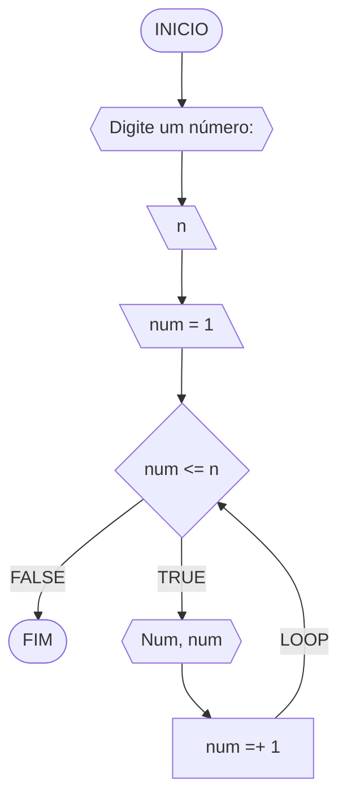
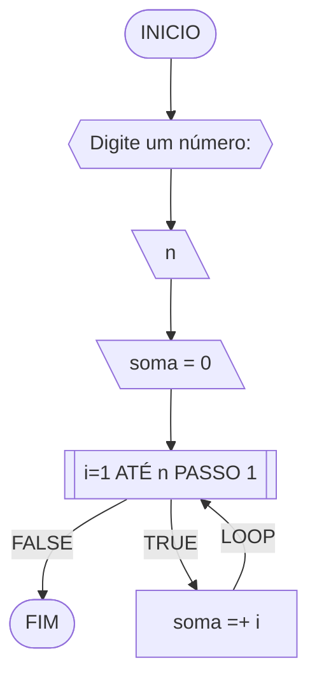
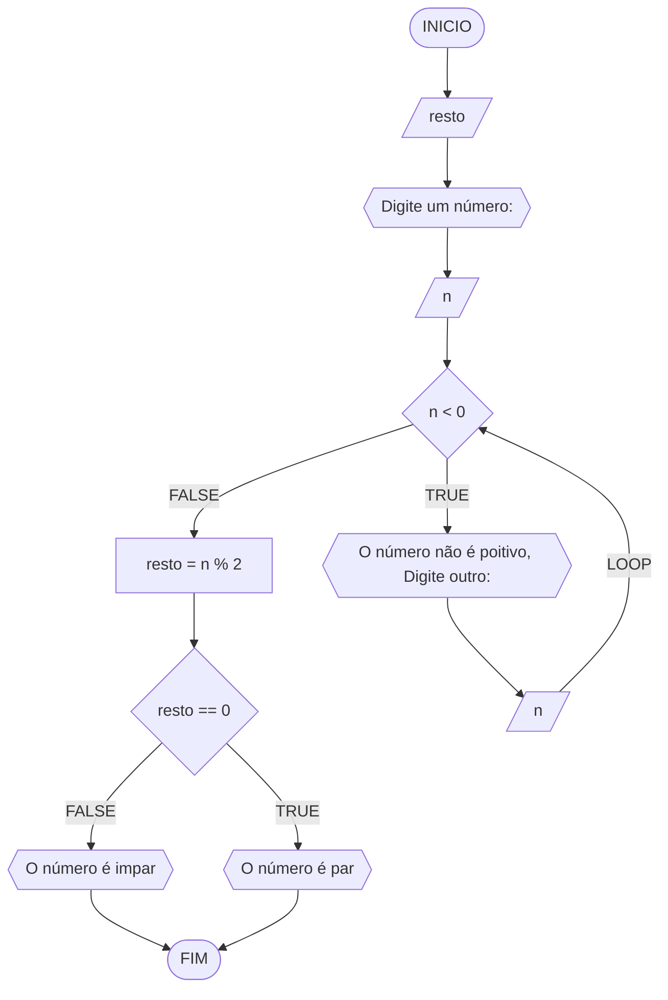
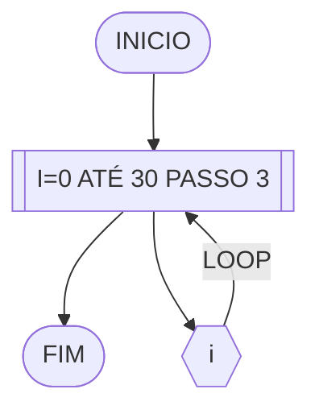
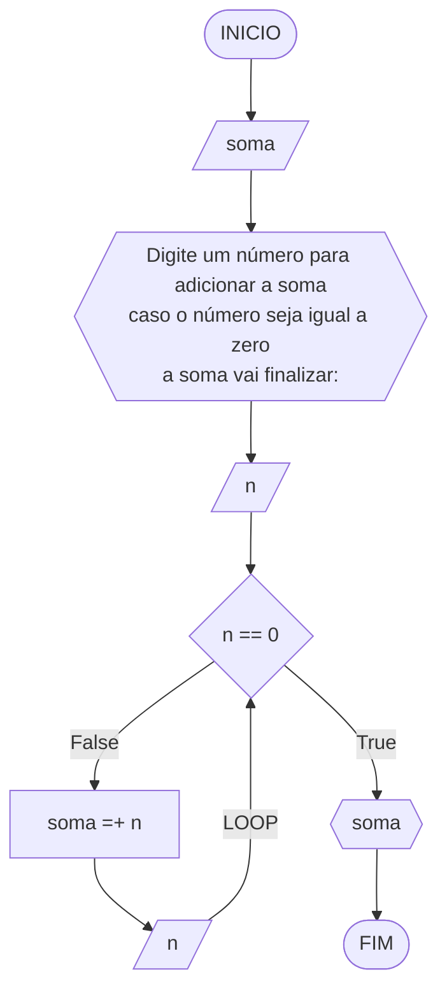
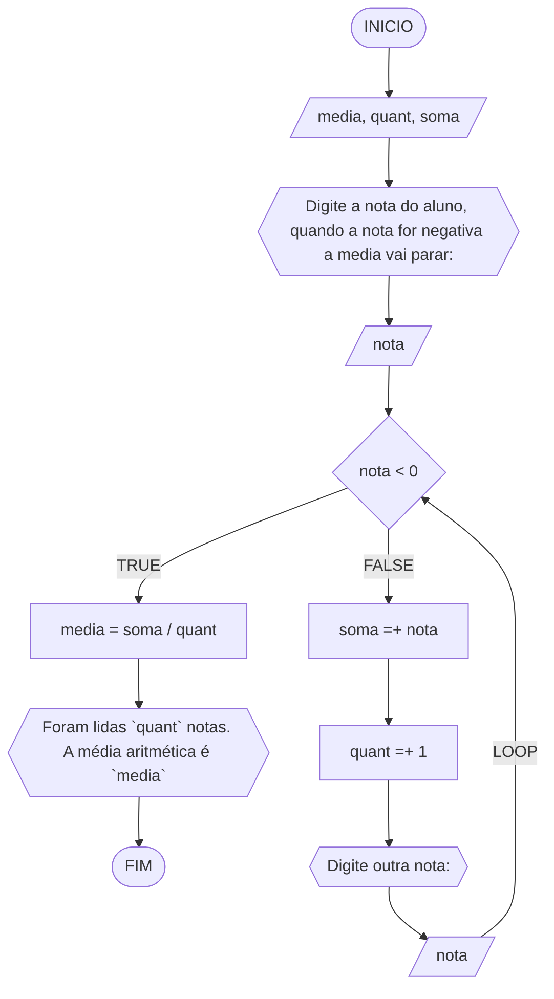

# UNIFOR
**Nome**: Alisson Frota Teixeira <br>
**Disciplina**: Raciocínio lógico algorítmico

## Exercício exemplo 1
Implemente e teste um programa que imprima os n primeiros números.

#### Fluxograma


#### Pseudocódigo
```
1 ALGORITMO print_n_primeiros
2 DECLARE n, num: INTEIRO
3 INICIO
4 ESCREVA “Digite um número: ”
4 LEIA n			// variável de entrada n
4 num ← 1			// variável num inicializada
5 ENQUANTO num <= n FAÇA	// n iterações
7	ESCREVA “Número ”, num
8	num ← num + 1		// num =+ 1 (incremento)
8 FIM_ENQUANTO
9 FIM
```

#### Teste de mesa
| it | n  | num | num <= n | Saída      | num =+ 1 |
| -- | -- | --  | --       | --         | --       |
| 1  | 10 | 1   | True     | Número 1   | 2        |
| 2  | 10 | 2   | True     | Número 2   | 3        |
| 3  | 10 | 3   | True     | Número 3   | 4        |
| 4  | 10 | 4   | True     | Número 4   | 5        |
| 5  | 10 | 5   | True     | Número 5   | 6        |
| 6  | 10 | 6   | True     | Número 6   | 7        |
| 7  | 10 | 7   | True     | Número 7   | 8        |
| 8  | 10 | 8   | True     | Número 8   | 9        |
| 9  | 10 | 9   | True     | Número 9   | 10       |
| 10 | 10 | 11  | True     | Número 10  | 11       |
| 11 | 10 | 11  | False    |            |          |

## Exercício exemplo 2
Implemente e teste um programa que some os n primeiros números.

#### Fluxograma


#### Pseudocódigo
```
1  ALGORITMO	soma_n_numeros()
2  DECLARE	n, i, soma: INTEIRO
3  INICIO
4  ESCREVA “Digite a quantidade de números: ”
5  LEIA n		// variável de entrada n
7  soma ← 0		// variável soma inicializada
6  PARA i DE 1 ATÉ n PASSO 1 FAÇA
7	soma ← soma + i	// soma =+ i (incremento)
8  FIM_PARA
9  ESCREVA “A soma é igual a ”, soma
10 FIM
```

#### Teste de mesa
| it | n  | soma | i  | soma =+ i |
| -- | -- | --   | -- | --        |
| 1  | 10 | 0    | 1  | 1         |
| 2  | 10 | 1    | 2  | 3         |
| 3  | 10 | 3    | 3  | 6         |
| 4  | 10 | 6    | 4  | 10        |
| 5  | 10 | 10   | 5  | 15        |
| 6  | 10 | 15   | 6  | 21        |
| 7  | 10 | 21   | 7  | 28        |
| 8  | 10 | 28   | 8  | 36        |
| 9  | 10 | 36   | 9  | 45        |
| 10 | 10 | 45   | 10 | 55        | 

## Lista de exercícios 03

### Exercício 01 (2.5 pontos)
Atualize o algoritmo para determinar se um número inteiro e positivo é par ou ímpar, usando uma laço condicional para aceitar apenas números maiores ou iguais a zero. 

#### Fluxograma (1.0 ponto)



#### Pseudocódigo (1.0 ponto)

```
Algoritmo ClassificaCategoria
DECLARE resto, n: INT
ESCREVA "Digite um número"
LEIA n
ENQUANTO n < 0 FAÇA
	ESCREVA "O número deve ser não negativo. Por favor, digite novamente: "
	LEIA n
FIM_ENQUANTO
resto <- n % 2
SE resto == 0 ENTAO
	ESCREVA "O número é par"
SENAO
	ESCREVA "O número é impar"
FIM_SE
FIM_ALGORITMO
```

#### Teste de mesa (0.5 ponto)

| n | n < 0 | resto | resto == 0 |  saída |
|      --      |      --      |      --      |      --      |      --      | 
| 10     | False       |  0   |  True     | O número é par    |
| 11   | False          | 5        | False | O número é impar  |

### Exercício 02 (2.5 pontos)
Faça um algoritmo que exiba na tela uma contagem de 0 até 30, exibindo apenas os múltiplos de 3.

#### Fluxograma (1.0 ponto)



#### Pseudocódigo (1.0 ponto)

```
Algoritmo ClassificaCategoria
DECLARE i: INT
INICIO
PARA i DE 0 ATÉ 30 PASSO 3 FAÇA
	ESCREVA i
FIM_PARA
FIM_ALGORITMO
```

#### Teste de mesa (0.5 ponto)

| it | saída |
|      --      |      --      |     
| 0     | 0       |   
| 1   | 3          | 
| 2 | 6 |
|      3    |      9      |     
| 4     | 12      |   
| 5   | 15          | 
| 6 | 18 |
|      7      |  21      |     
| 8     | 24 |   
| 9   | 27 | 
| 10 | 30 |


### Exercício 03 (2.5 pontos)
Dada uma sequência de números inteiros, calcular a sua soma. 
Por exemplo, para a sequência {12, 17, 4, -6, 8, 0}, o seu programa deve escrever o número 35.

#### Fluxograma (1.0 ponto)



#### Pseudocódigo (1.0 ponto)

```
Algoritmo ClassificaCategoria
DECLARE soma, n: INT
INICIO
soma <- 0
ESCREVA "Digite um número para adicionar a soma, quando o número for iqual a zero a soma vai finalizar: "
REPITA
	LEIA n
	soma <- soma + n
ATE_QUE n == 0
FIM_LOOP
ESCREVA soma
FIM_ALGORITMO
```

#### Teste de mesa (0.5 ponto)

| n | soma | n == 0 | 
|      --      |      --      | -- | 
| 5     | 5       | False
| 3   | 8          | False
| 3   | 11          | False
| -4   | 7          | False
| 0   | 7          | True

### Exercício 04 (2.5 pontos)
Escreva um programa que leia a nota de diversos alunos, até que seja digitada uma nota negativa. 
Nesse momento, ele mostra a média aritmética de todas as notas lidas e quantas notas foram lidas. 
Ex. Foram lidas 14 notas. A média aritmética é 6.75!

#### Fluxograma (1.0 ponto)



#### Pseudocódigo (1.0 ponto)

```
Algoritmo ClassificaCategoria
DECLARE media, soma, nota: FLOAT, quant: INT
INICIO
soma <- 0
quant <- 0
ESCREVA "Digite a nota do aluno, quando a nota for negativa a media vai parar: "
LEIA n
ENQUANTO n >= 0 FAÇA
	soma <- soma + n
	quant <- quant + 1
	ESCREVA "Digite outra nota: "
	LEIA n
FIM_LOOP
media <- soma / quant
ESCREVA "Foram lidas `quant` notas. A média aritmética é `media`", quant, 
FIM_ALGORITMO
```

#### Teste de mesa (0.5 ponto)

| n | soma | quant | n >= 0 | media | 
|      --      |      --      |      --      |      --      |      --      | 
| 7.0     | 7.0       | 1    |  True     |     |
| 4.0     | 10.0       | 2    |  True     |     |
| -2.0     |        |     |  False     | 5.0    |
